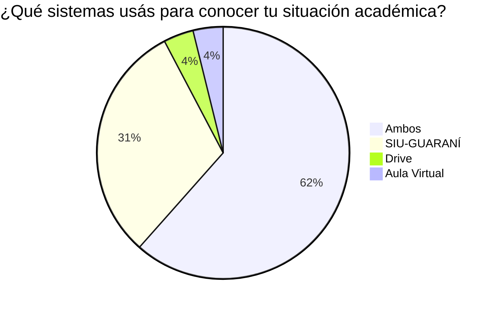
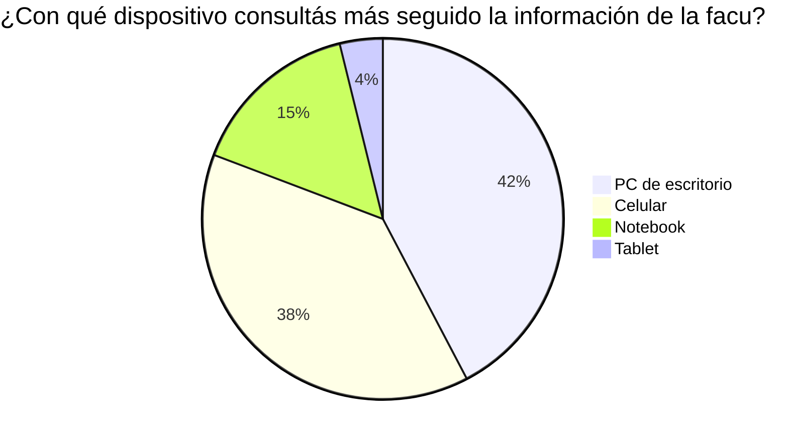

# Problema

> ¿Por qué existe Neo Aula Virtual?

## Contexto

La UTN resuelve la gestión académica de la cursada con dos sistemas consolidados: el **SIU-GUARANÍ** (legajo, calificaciones, inscripciones, plan de estudios) y el **Aula Virtual** (materiales y actividades de las cátedras). Ambos cumplen su función administrativa, pero la información del estudiante vive **fragmentada**:

- La agenda y el legajo se consultan en el SIU-GUARANÍ.
- Los materiales y las actividades, en el Aula Virtual.
- El plan de estudios no se integra con la agenda, los horarios ni el progreso real del estudiante.
- Ninguno de los dos ofrece un seguimiento visual del avance de la carrera.

El estudiante reconstruye **manualmente** un panorama que ningún sistema le da unificado, y no existe un entorno móvil que integre esa información.

## Evidencia empírica (encuesta n=26)

Los datos de la [encuesta](./05-encuesta.md) a estudiantes de 1° a 5° año cuantifican el problema:

| Dato | Resultado |
|---|---|
| Consulta su situación académica en más de un sistema | **59%** |
| Perdió al menos una entrega, fecha o aula por la info repartida | **62%** |
| No sabe con seguridad qué materias puede cursar según su estado | **58%** |
| No tiene una visión clara del avance de su carrera | **50%** |
| Consulta desde escritorio / teléfono / notebook | 42% / 38% / 15% |
| Considera incómodo usar AV y SIU-GUARANÍ desde el celular | **54%** |
| Usaría una app que unifique plan, horarios, comisiones y entregas | **88%** |

## Fricciones del Aula Virtual (contexto)

Más allá de la fragmentación, el uso cotidiano del Aula Virtual desde el celular presenta fricciones propias que motivaron el enfoque mobile-first del proyecto:

### Autenticación
- La sesión expira rápido, obligando a iniciar sesión desde cero en cada uso.
- La página de login presenta dos métodos en cada inicio.

### Página principal
- Interfaz visualmente sobrecargada con elementos innecesarios.
- Imágenes no responsive que desbordan el viewport móvil.
- Sin priorización: todas las materias aparecen igual, sin considerar cuáles están activas hoy.

### Navegación dentro de la materia
- El menú lateral está oculto detrás de un botón poco visible, del mismo color que el fondo, fuera de la barra de navegación principal.
- Las clases se listan desde la primera hasta la última, sin acceso rápido a la más reciente.

### Acceso al material
- Los archivos no tienen vista previa ni categorización.
- Los nombres de los PDFs, a veces, no son descriptivos.
- El estudiante debe descargar cada archivo individualmente para identificar cuál es el relevante.

## Ausencias identificadas

- No existe seguimiento visual del progreso en la carrera.
- No hay integración entre el Aula Virtual y el SIU-GUARANÍ (legajo, horarios, agenda académica).
- La plataforma no tiene sistema de reconocimiento ni logros para el estudiante.

## Soluciones externas existentes

La demanda de una herramienta complementaria se evidencia en soluciones no oficiales desarrolladas por los propios estudiantes:

- Extensiones de navegador para seguimiento de materias: https://github.com/pablomatiasgomez/utn.ba-helper
- Visualizador independiente: https://visualizador-materias.web.app/
- Portal de FMT: https://ceitfmt.ar/login
- Portal de iTEC: (actualmente en desarrollo)

También hay docentes que desarrollaron plataformas propias ante las limitaciones del Aula Virtual oficial. Ej: https://www.pdep.com.ar — sitio independiente creado por cátedras de UTN, que además migró la comunicación con alumnos a Discord.
