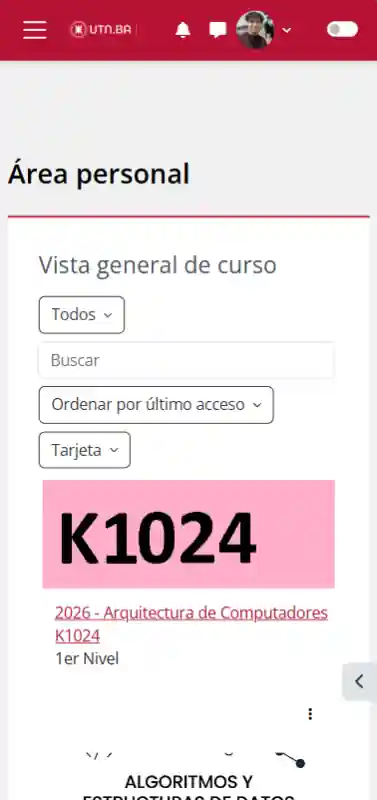
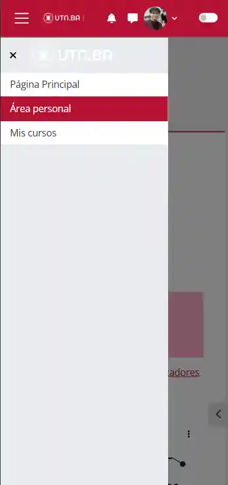

# Problema

> Sintesis de la fricción con el Aula Virtual

## Contexto
Los estudiantes de la UTN acceden al Aula Virtual mayoritariamente desde dispositivos móviles, en situaciones de uso real como el transcurso de una clase. La plataforma fue diseñada con criterio desktop-first y no contempla este escenario.

## Fricciones identificadas

### Autenticación
- La sesión expira rápido, obligando a iniciar sesión desde cero en cada uso.
- La página de login presenta dos métodos en cada inicio.

### Página principal
- Interfaz visualmente sobrecargada con elementos innecesarios.
- Imágenes no responsive que desbordan el viewport móvil.
- Sin filtro ni priorización: todas las materias aparecen igual, sin considerar cuáles están activas hoy.

### Navegación dentro de la materia
- El menú lateral está oculto detrás de un botón poco visible, del mismo color que el fondo, fuera de la barra de navegación principal.
- Las clases se listan desde la primera hasta la última, sin acceso rápido a la más reciente.

### Acceso al material
- Los archivos no tienen vista previa ni categorización.
- Los nombres de los PDFs, a veces, no son descriptivos.
- El estudiante debe descargar cada archivo individualmente para identificar cuál es el relevante.

## Capturas

<table align="center">
  <tr>
    <td align="center">
      
       Captura -
       "Inicio"
    </td>
    </td>
    <td align="center">
      
       Captura -
       "Área de materia"
    </td>
  </tr>
  <tr>
    <td align="center">
      
       Captura -
       "Menú Lateral"
    </td>
    </td>
    <td align="center">
      
       Captura -
       "Sección Material"
    </td>
  </tr>
</table>

## Ausencias identificadas
- No existe seguimiento visual del progreso en la carrera.
- No hay integración entre el Aula Virtual y el SIU-Guaraní
  (legajo, horarios, agenda académica).
- La plataforma no tiene sistema de reconocimiento ni logros para el estudiante.

## Evidencia Empírica

- Estudiantes desarrollaron soluciones externas no oficiales para suplir estas ausencias:
  - Extensiones de navegador para seguimiento de materias: https://github.com/pablomatiasgomez/utn.ba-helper
  - Visualizador independiente: https://visualizador-materias.web.app/
  - Portal de FMT: https://ceitfmt.ar/login
  - Portal de iTEC: (Actualmente en desarrollo)

- Docentes de la carrera desarrollaron plataformas propias ante las limitaciones del Aula Virtual oficial.
  Ej: https://www.pdep.com.ar — sitio independiente creado por cátedras de UTN
  Además migró la comunicación con alumnos a Discord