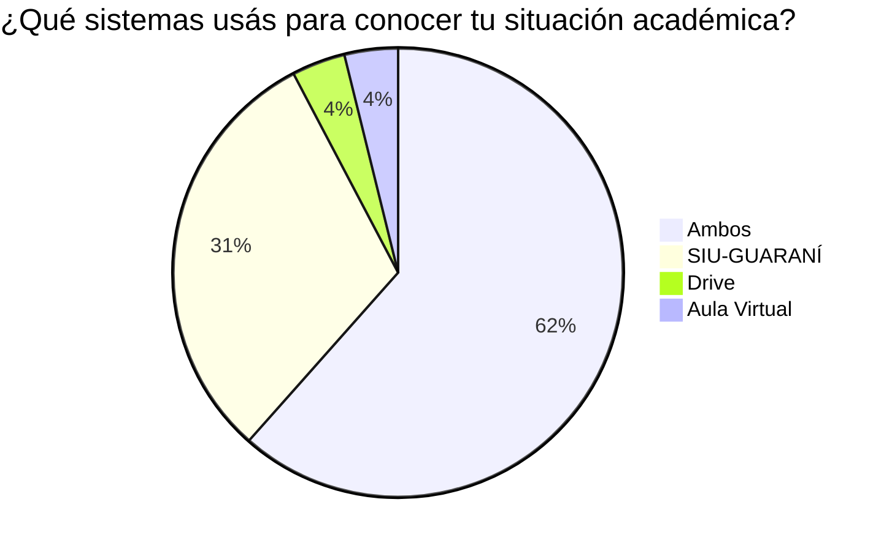
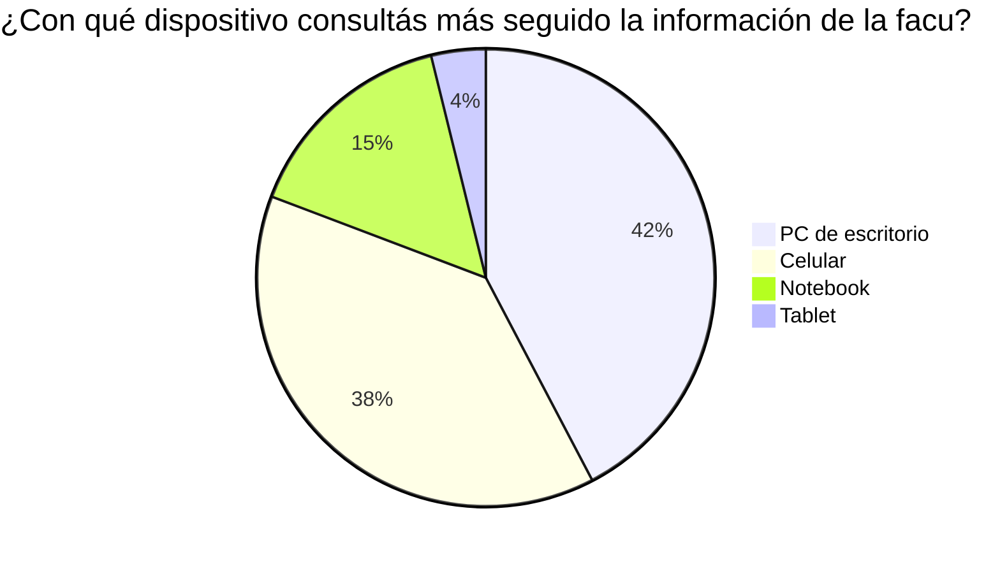
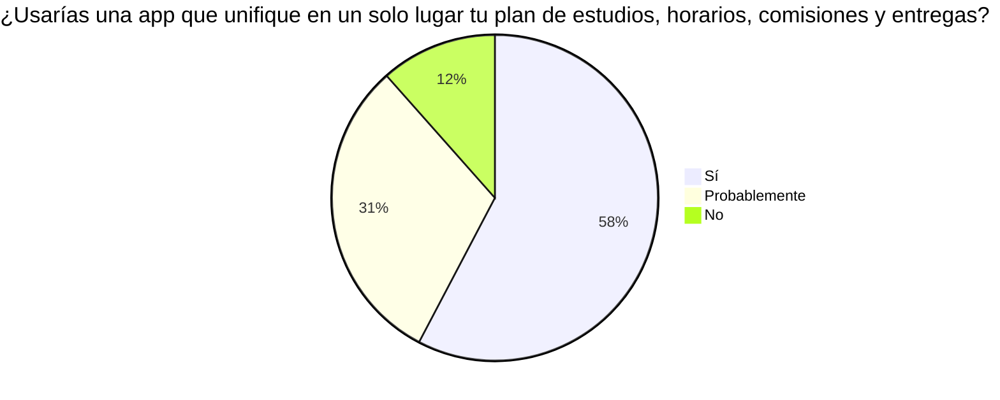

# Encuesta a estudiantes

> Encuesta anónima (Google Forms) a estudiantes de la carrera, de 1° a 5° año.
> **n = 26** al momento de redacción (agosto 2026). Resultados reportados en el [paper](./pdfs/Neo%20Aula%20Virtual%20-%20Paper.pdf).

## Resultados

### Consulta de la situación académica

- El **59%** consulta su situación académica en **más de un sistema** (Figura 1).
- El **62%** perdió al menos una vez una entrega, una fecha o un aula por tener la información repartida en distintos lugares.

### Conocimiento del plan de estudios

- El **58%** no conoce con seguridad **qué materias puede cursar** según su estado actual.
- El **50%** declaró no tener una visión clara de su **avance en la carrera**.

### Uso móvil

- Dispositivos de consulta: escritorio **42%**, teléfono **38%**, notebook **15%** (Figura 2).
- El **54%** considera incómodo o muy incómodo usar el Aula Virtual y el SIU-GUARANÍ desde el celular.

### Intención de adopción

- El **88%** (suma de «Sí» y «Probablemente», Figura 3) manifestó que **usaría una aplicación** que unifique en un solo lugar el plan de estudios, los horarios, las comisiones y las entregas.

## Recomendaciones de los encuestados

Las sugerencias de texto libre (7 de 35 respuestas) están clasificadas en [ideas.md](./ideas.md#sugerencias-de-los-encuestados), indicando cuáles ya están integradas a la app y cuáles quedan como trabajo futuro.
